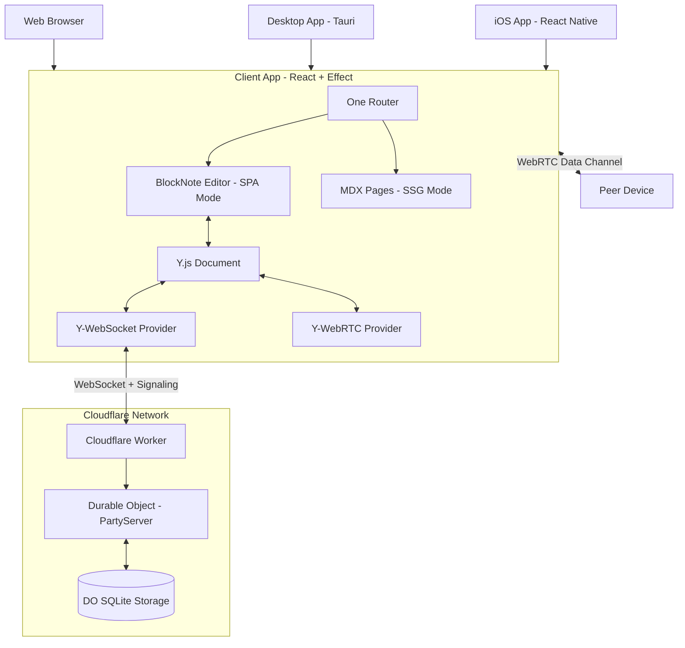

# Architectural Specification: Minimalist Block Editor (Project "Kajet")

## 1. Vision & Scope
*   **Inspiration**: Dropbox Paper / Notion (Block-based, Clean, Collaborative).
*   **Deployment Targets**:
    *   **Web**: Browser-based application (PWA-capable)
    *   **Desktop**: Native macOS app via Tauri
    *   **Mobile**: Native iOS app via One Router (Android planned for future)
*   **Key Features**:
    *   **Block-Based Editing**: Slash commands, drag-and-drop blocks, rich media embedding (BlockNote).
    *   **Static Content**: MDX-powered landing pages, documentation, and marketing content.
    *   **Real-Time Collaboration**: Google Docs-style multiplayer with cursors and presence.
    *   **Comments**: Anchored comments on text selections with reply threads.
    *   **Cloud-Native Persistence**: Documents live in Cloudflare Durable Objects using **SQLite**.
    *   **Hybrid Sync**: `y-webrtc` for low-latency peer-to-peer sync + `y-websocket` (via PartyServer) for persistence and signaling.
    *   **Customization**: Per-document font, size, and width settings (Google Fonts).
    *   **Tech Stack**: EffectTS, React, One Router, Y.js, BlockNote, MDX, Cloudflare Workers (SQLite), PartyServer, Tauri, Turborepo, Tailwind/Uniwind.

## 2. Architecture Overview

### 2.1. System Diagram


### 2.2. Platform Strategy

#### Web
*   **Build Target**: Standard web application
*   **Deployment**: Cloudflare Pages (or similar)
*   **Styling**: Tailwind CSS
*   **Router**: One Router (SSG + SPA)

#### Desktop (macOS)
*   **Technology**: Tauri
*   **Why**: Lightweight, web-tech based, native performance
*   **Approach**: Wraps the web app in a native shell
*   **Distribution**: .app bundle, Mac App Store (future)

#### Mobile (iOS)
*   **Technology**: One Router + React Native
*   **Why**: True native performance, platform APIs access
*   **Build**: `one prebuild` → Xcode → TestFlight/App Store
*   **Styling**: Uniwind (Tailwind for React Native)
*   **Distribution**: TestFlight, App Store

### 2.3. Monorepo Structure (Turborepo)
```
kajet/
├── apps/
│   ├── web/                  # One Router app (web + iOS native)
│   │   ├── app/
│   │   │   ├── index.tsx     # Landing page (MDX)
│   │   │   ├── docs/
│   │   │   │   └── [slug].tsx  # MDX documentation (SSG)
│   │   │   └── doc/
│   │   │       └── [id].tsx    # Editor (SPA)
│   │   ├── data/             # MDX content source
│   │   ├── global.css        # Tailwind + Uniwind
│   │   ├── ios/              # Generated by 'one prebuild'
│   │   ├── vite.config.ts
│   │   ├── react-native.config.cjs
│   │   └── app.json          # Expo config
│   ├── desktop/              # Tauri wrapper (macOS)
│   │   ├── src-tauri/        # Rust code
│   │   └── src/              # Shared with web
│   └── worker/               # Cloudflare Worker
│       └── src/
│           ├── index.ts
│           └── SyncRoom.ts   # Durable Object
├── packages/
│   ├── ui/                   # Shared React components
│   ├── editor/               # BlockNote + Y.js integration
│   └── shared/               # Common types/utils
├── turbo.json
└── package.json
```

### 2.4. Content Strategy

#### BlockNote (Live Editor)
*   **Route**: `/doc/[id]` (SPA mode)
*   **Purpose**: Real-time collaborative editing
*   **Data**: Y.js CRDT synced to Cloudflare
*   **Platforms**: All (Web, Desktop, iOS)

#### MDX (Static Pages)
*   **Routes**: `/`, `/docs/[slug]`, `/features`, etc. (SSG mode)
*   **Purpose**: Landing pages, marketing, documentation
*   **Data**: MDX files in `data/` directory
*   **Build**: Pre-rendered at build time using `@vxrn/mdx`
*   **Platforms**: Web + Desktop (Tauri serves static files), iOS (bundled)

### 2.5. Data Model (Y.js + SQLite)

#### Y.js Structure
*   `xmlFragment("document-store")`: The BlockNote content tree.
*   `map("settings")`: Document visual configuration (font, size, width).
*   `array("comments")`:
    *   Each item: `{ id: string, anchor: Y.RelativePosition, content: Y.Text, replies: Y.Array }`.

#### SQLite Schema (Durable Object)
```sql
CREATE TABLE IF NOT EXISTS updates (
  id INTEGER PRIMARY KEY AUTOINCREMENT,
  update_blob BLOB NOT NULL,
  created_at INTEGER DEFAULT (unixepoch())
);

CREATE TABLE IF NOT EXISTS snapshots (
  id INTEGER PRIMARY KEY AUTOINCREMENT,
  state_vector BLOB NOT NULL,
  snapshot_blob BLOB NOT NULL,
  created_at INTEGER DEFAULT (unixepoch())
);
```

## 3. Frontend Architecture (Client)

### 3.1. Core Tech
*   **Framework**: React 19.
*   **Control Flow**: EffectTS.
*   **Routing**: One Router (file-system based, universal).
*   **Editor**: `@blocknote/react` + `@blocknote/core`.
*   **Static Content**: `@vxrn/mdx` + `mdx-bundler`.
*   **Styling**: Tailwind (web/desktop) + Uniwind (iOS).
*   **Desktop**: Tauri.
*   **Mobile**: One Router native (React Native).

### 3.2. Styling Strategy

#### Web + Desktop (Tauri)
*   Standard Tailwind CSS
*   Custom theme in `global.css`
*   Platform-specific utilities via `web:` prefix

#### Mobile (iOS)
*   Uniwind (Tailwind for React Native)
*   Same `global.css` as web
*   Platform-specific utilities:
    *   `ios:` - iOS only
    *   `native:` - Mobile platforms

#### Shared Configuration
```css
/* global.css */
@import 'tailwindcss';
@import 'uniwind';

@layer theme {
  :root {
    --color-primary: #3b82f6;
    --font-sans: "Inter";
    
    @variant dark {
      --color-primary: #60a5fa;
    }
    
    @media ios {
      --font-sans: "SF Pro Text";
    }
    
    @media web {
      --font-sans: "Inter", system-ui;
    }
  }
}
```

### 3.3. One Router Configuration

#### MDX Pages (SSG)
```tsx
// app/docs/[slug].tsx
export async function generateStaticParams() {
  const { getAllFrontmatter } = await import("@vxrn/mdx");
  const frontmatters = getAllFrontmatter("data");
  return frontmatters.map(({ slug }) => ({ slug }));
}

export async function loader({ params }) {
  const { getMDXBySlug } = await import("@vxrn/mdx");
  return await getMDXBySlug("data", params.slug);
}
```

#### Editor Pages (SPA)
```tsx
// app/doc/[id].tsx - No generateStaticParams (client-side only)
export function DocEditor() {
  const { id } = useParams();
  // BlockNote + Y.js logic
}
```

### 3.4. Build Configuration

#### Vite (Web + Desktop)
```ts
// vite.config.ts
export default defineConfig({
  ssr: {
    noExternal: true,
    external: ['@vxrn/mdx'],
  },
  plugins: [
    one({
      web: {
        defaultRenderMode: 'ssg',
      },
    }),
  ],
})
```

#### React Native (iOS)
```js
// react-native.config.cjs
module.exports = {
  commands: [...require('vxrn/react-native-commands')]
}
```

```json
// app.json
{
  "expo": {
    "plugins": ["vxrn/expo-plugin"]
  }
}
```

#### Tauri (macOS Desktop)
```toml
# src-tauri/tauri.conf.json
{
  "build": {
    "beforeDevCommand": "bun dev",
    "beforeBuildCommand": "bun run build",
    "devPath": "http://localhost:5173",
    "distDir": "../dist"
  }
}
```

### 3.5. Collaboration Layer
*   **Y.js**: The CRDT engine.
*   **Hybrid Provider Strategy**:
    *   **y-webrtc**: Primary sync for active peers (faster, cheaper).
    *   **y-websocket** (PartyServer):
        1.  **Persistence**: Saves state to Cloudflare.
        2.  **Signaling**: Acts as the signaling server for WebRTC.
        3.  **Fallback**: Syncs data if P2P fails.

### 3.6. Features
*   **Cursors**:
    *   Synced via `y-webrtc` Awareness (ephemeral).
    *   Displayed as floating colored flags with names.
*   **Comments**:
    *   UI: Sidebar or floating bubbles next to text.
    *   Logic: Text selection -> Create `Y.RelativePosition` -> Add to `comments` array -> Render marker in Editor.

## 4. Backend Architecture (Cloudflare)

### 4.1. Worker & Durable Object (PartyServer)
*   **Class**: `KajetServer extends Server`
*   **Hibernation**: Enabled (`hibernation: true` in config).
    *   Use `ctx.acceptWebSocket(ws)` to let the OS handle idle connections.
    *   Wake up only on messages.
*   **Logic**:
    *   **Signaling**: Forward WebRTC signaling messages (offer/answer/candidate) between peers.
    *   **Persistence**: Listen for Y.js sync messages and write to SQLite.

## 5. UI/UX Design
*   **Clean Interface**: Minimal chrome.
*   **Comments**:
    *   "Comment Mode" or selection context menu "Add Comment".
    *   Highlighted text range (yellow background).
    *   Click highlight -> Show comment thread in popover.
*   **Settings UI**: Popover for Font/Size/Width (Google Fonts integration).

## 6. Implementation Stages
1.  **Skeleton**: Turborepo + One Router (web base).
2.  **Static Pages**: MDX setup for landing/docs.
3.  **Styling**: Tailwind/Uniwind configuration.
4.  **Editor**: Basic BlockNote implementation.
5.  **Backend**: Cloudflare DO + SQLite + PartyServer (Hibernation enabled).
6.  **Wiring**:
    *   Connect `y-websocket` (PartyServer) for storage.
    *   Connect `y-webrtc` (using PartyServer as signaling).
7.  **Features**:
    *   Comments (Anchoring logic).
    *   Settings (Fonts).
8.  **iOS**: Run `one prebuild`, configure Xcode, TestFlight.
9.  **Desktop**: Tauri wrapper for macOS builds.

## 7. Platform-Specific Notes

### Web
*   No special setup beyond Vite + One Router
*   Deploy to Cloudflare Pages

### iOS
*   Requires `one prebuild` to generate `ios/` directory
*   Use Expo Go for dev (no prebuild needed)
*   For production: Xcode → Archive → TestFlight/App Store
*   Apple Developer account required

### Desktop (macOS)
*   Tauri wraps the web build
*   Rust toolchain required for development
*   Code signing for distribution
